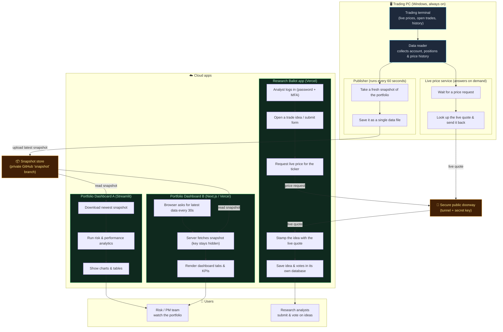

# Architecture

There is **one source of truth** — the MetaTrader 5 terminal on the Windows
trading PC (Century Financial account `910001`) — feeding **two separate apps**
through **two different pipelines**.

## The data origin

The MT5 terminal holds live prices, open positions, and trade history. A Python
access layer (`mt5_connector.py`) reads it; `data_source.py` packages it into a
tidy bundle (account, positions, today's P&L, deal history, price histories).

## Pipeline A — the Portfolio Dashboard (batch, every 60s)

- `pusher.py` runs in a loop on the PC: pull live data → flatten to JSON →
  commit `snapshot.json` to a dedicated **`snapshot`** GitHub branch (kept off
  `main` so it never triggers rebuilds).
- Two read-only frontends consume that snapshot:
  - **Streamlit dashboard** (`dashboard.py`) on Streamlit Cloud.
  - **Next.js dashboard** (`web/`) on Vercel — its `/api/snapshot` route fetches
    the file from GitHub (token stays server-side) and the browser polls every 30s.
- Run locally with no cloud secrets, `dashboard.py` skips GitHub and reads MT5
  directly.

## Pipeline B — the Research Ballot (live, on demand)

- `mt5_service.py` is a small HTTP service (port 8765) wrapping the same
  connector, exposing live `/health` and `/quote`.
- `cloudflared` tunnels it to a public URL.
- The **Research Ballot** app (separate `apex-platform` repo, Vercel) calls it
  through `/api/mt5/*` so analysts get a live price the moment they submit/score
  an idea. This app has its own database + login/MFA for the research-voting
  workflow — MT5 only supplies the live price.

**Entry points:** `dashboard.py` (Streamlit), `web/` page → API routes (Next
dashboard), Research Ballot login → dashboard pages, plus two background daemons
on the PC: `pusher.py` and `mt5_service.py`.

## Flowchart

## Label → file map

| Diagram step | Actual code |
|---|---|
| Trading terminal / Data reader | MT5 terminal · `mt5_connector.py`, `data_source.py` |
| Publisher (every 60s) | `pusher.py` |
| Live price service | `mt5_service.py` (port 8765) |
| Secure public doorway | `cloudflared` tunnel + `MT5_SERVICE_KEY` |
| Snapshot store | GitHub `snapshot` branch → `snapshot.json` |
| Dashboard A | `dashboard.py` (Streamlit Cloud) |
| Dashboard B | `web/` → `app/api/snapshot/route.ts` (Vercel) |
| Research Ballot app | `apex-platform` repo → `app/api/mt5/*`, Prisma DB, auth |
